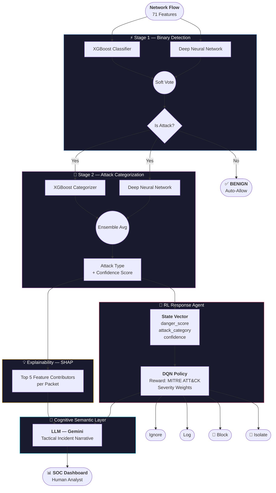

# 🛡️ ARSS — Autonomous Response System for SOC


> **Autonomous alert triage system that sits between the SIEM and the human SOC analyst — reducing burnout by auto-handling the noise and surfacing only what matters.**

---

## 🎯 The Problem

SOC analysts face thousands of alerts daily. Most are false positives. The result is alert fatigue — analysts burn out, real threats get missed, and organizations get breached not because the tools failed, but because the humans behind them did.

ARSS doesn't try to replace the analyst. It protects their attention.

---

## ❓ Why ARSS — Hasn't This Been Solved?

The market has solved **detection**. Firewalls block. IDS flags. SIEM aggregates. Tools like CrowdStrike, Palo Alto XSOAR, and Splunk SOAR even automate responses.

**But nobody has solved trust.**

SOC analysts routinely override or ignore automated decisions because they can't see the reasoning behind them. A system that says "Blocked" with no explanation doesn't reduce burnout — it creates a different kind of anxiety. Analysts can't trust what they can't understand, and what they can't trust, they don't adopt.

| What The Market Solved | What Remains Unsolved |
|------------------------|----------------------|
| Detecting threats | Explaining *why* something was flagged |
| Automating responses | Justifying *why* that response was chosen |
| Aggregating alerts | Telling analysts what it means in plain English |
| Blocking at scale | Building analyst trust in autonomous decisions |

ARSS is not another detection engine. It's an **explainable, trustworthy triage agent** — one that shows its reasoning at every step, speaks to analysts in plain English, and grounds every decision in the MITRE ATT&CK framework that security teams already understand.

> "The tools exist. The adoption doesn't. The missing piece is trust."

---

## 🏗️ Where ARSS Sits

```
Raw Traffic
→ Firewall
→ IDS/IPS  (Snort, Suricata — signatures, pattern matching)
→ SIEM     (alert aggregation)
→ [ARSS]   ← sits here
→ Human SOC Analyst
```

ARSS receives alerts that have already passed every upstream filter. Its job is triage — auto-handle what's obvious, escalate only what genuinely needs human judgment.

---

## 🧠 System Architecture



---

## 🔬 Research Contributions

1. **Category-Conditioned RL State Space** — Agent sees attack semantics (type + confidence), not just a risk score. A MITM at 70% confidence is treated differently from a Recon scan at 70%.

2. **MITRE ATT&CK Grounded Reward Function** — Response policy is trained using severity weights derived from the MITRE ATT&CK framework, eliminating hand-crafted heuristics.

3. **Cognitive Semantic Layer** — LLM translates SHAP output + RL decision into plain-English incident narratives, reducing cognitive load for junior analysts.

4. **Evaluated on CIC-IIoT 2025** — One of the first evaluations of this pipeline on the most recent IIoT security benchmark.

---

## 📊 Current Results (v2 Baseline)

| Stage | Model | Metric | Result |
|-------|-------|--------|--------|
| Stage 1 | XGBoost + DNN Ensemble | Recall | 92.34% |
| Stage 2 | XGBoost + DNN Ensemble | Accuracy | 92.83% |
| Dataset | CIC-IIoT 2025 | Samples | 685K |

> Note: No SMOTE used. Honest accuracy on real traffic distributions.

---

## 🔬 Tech Stack

| Component | Technology |
|:----------|:-----------|
| AI / ML | TensorFlow Keras, XGBoost |
| Explainability | SHAP |
| RL Agent | Q-Learning (redesign to DQN in progress) |
| Backend | Flask (Python) |
| Frontend | HTML5, Chart.js |
| Dataset | CIC-IIoT 2025 |

---

## 📂 Project Structure

```
ARSS/
├── v1/                  # Legacy — CICIDS2017, single-stage DNN
├── v2/                  # Current — CIC-IIoT 2025, two-stage ensemble
│   ├── server/          # API, detector, decider, explainer, config
│   ├── models/          # Trained model artifacts
│   ├── ui/              # SOC dashboard
│   └── train_v2.py      # Training pipeline
├── docs/                # Research documents and session journal
└── requirements.txt
```

---

## 🚀 Quick Start

```bash
git clone https://github.com/Deez-Automations/DTRA---Dynamic-Threat-Response-Agent.git
cd DTRA
pip install -r requirements.txt

# Terminal 1 — Start API server
python v2/server/api.py

# Terminal 2 — Simulate live traffic
python v2/replay_traffic.py

# Open v2/ui/soc_dashboard.html in browser
```

---

## 📅 Project Timeline

| Phase | Period | Focus |
|-------|--------|-------|
| v1 | Summer – Dec 2025 | Baseline system, CICIDS2017, A* + Q-Learning |
| v2 | Jan 2026 | Two-stage ensemble, CIC-IIoT 2025, live dashboard |
| Research | Feb – Apr 2026 | RL redesign direction, literature review |
| Proposal Defense | ~May 2026 | Title + architecture defense |
| Implementation | Jun – Dec 2026 | DQN agent, LLM layer, experiments |
| FYP Defense | Jan 2027 | Final paper + defense |

---

## 👥 Team

| Name | ID |
|------|----|
| Daniyal | 2023406 |
| Haider | 2023416 |
| Daud | 2023677 |

*GIKI — CS 351 AI Lab / Senior Design Project*
*© 2026 ARSS Team*
