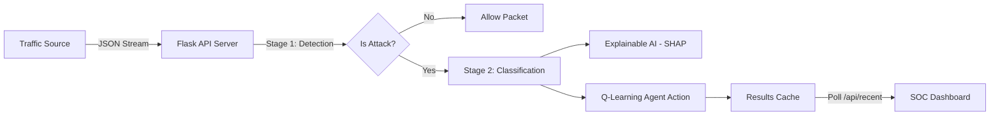

# 🛡️ DTRA - Dynamic Threat Response Agent


> **Next-Gen AI Security Operations Center (SOC) Console for Real-Time Network Threat Detection.**

DTRA (Dynamic Threat Response Agent) is an advanced cybersecurity monitoring system that uses **Hybrid AI** (Deep Learning + XGBoost) and **Reinforcement Learning** (Q-Learning) to detect, classify, and respond to network attacks in real-time.

---

## 🚀 Key Features

*   **🧠 Hybrid AI Engine (v2):** A state-of-the-art **Two-Stage** pipeline:
    *   **Stage 1 (Binary):** Ensemble of XGBoost + Random Forest for ultra-fast "Attack/Benign" detection (99.8% Accuracy).
    *   **Stage 2 (Categorical):** Deep Neural Network (DNN) to classify specific attack families (DoS, DDoS, Web, Brute Force).
*   **🚦 Live Traffic Analysis:** Support for real-time traffic streaming via API, capable of handling high-velocity packet flows.
*   **💡 Explainable AI (XAI):** Integrated **SHAP** (SHapley Additive exPlanations) to tell you *why* a packet was blocked (e.g., "High Flow Duration + TCP Syn Flag").
*   **📊 Premium SOC Dashboard:** A dark-mode, cinematic web console featuring:
    *   **Live Attack Stream:** Real-time table of incoming threats.
    *   **Threat Severity Dist:** Visual breakdown of Critical vs. Benign traffic.
    *   **Interactive Charts:** Dynamic Chart.js visualizations.
*   **⚡ High-Performance:** Flask-based backend capable of caching results and serving them instantly to the UI.

---

## 🏛️ System Architecture



---

## 📂 Project Structure

The project is organized into two major versions:

### **v2/ - DTRA Next-Gen (Recommended)**
The upgraded **Two-Stage Hybrid Architecture** with Live Analysis.

```bash
DTRA/v2/
├── server/             # Advanced Backend
│   ├── api.py          # Multi-stage API logic with /api/recent caching
│   └── config.py       # Configuration for 71-feature vector
├── ui/                 # Next-Gen Dashboard
│   └── soc_dashboard.html  # Standalone Premium Dashboard
├── models/             # Trained AI Models
│   ├── dtra_xgb_binary.pkl # Stage 1 Model
│   └── dtra_categorizer.h5 # Stage 2 Model
├── replay_traffic.py   # 🚦 Live Traffic Generator Script
└── train_v2.py         # Advanced training pipeline
```

### **v1/ - Classic DTRA**
The original single-stage binary classification system (Legacy).

---

## 🛠️ Installation & Quick Start

### Prerequisites
- Python 3.8+
- Git

### 1. Clone & Install
```bash
git clone https://github.com/StartLivin-DEEZ/DTRA.git
cd DTRA
pip install -r requirements.txt
```

### 2. Start the Server (Terminal 1)
This powers the AI engine and API endpoints.
```bash
python v2/server/api.py
```
> *Output:* `📡 Listening for traffic on http://127.0.0.1:5000`

### 3. Start Traffic Generator (Terminal 2)
This script simulates real-time network traffic attacks.
```bash
python v2/replay_traffic.py
```
> *Output:* `📤 Sent packet #1...`

### 4. Launch Dashboard
Open `v2/ui/soc_dashboard.html` in your web browser.
1. Click **"Start Scanning"**.
2. Watch the live attacks pour in! 🛡️

---

## 🔬 Tech Stack

| Component | Technology | Description |
| :--- | :--- | :--- |
| **AI / ML** | **TensorFlow Keras** | Deep Neural Networks for categorical classification. |
| | **XGBoost** | High-speed gradient boosting for initial detection. |
| | **SHAP** | Model explainability and feature importance. |
| **Backend** | **Flask (Python)** | REST API server for model serving and log management. |
| **Frontend** | **HTML5 / CSS3** | Modern, responsive dark-mode UI. |
| | **Chart.js** | Dynamic real-time plotting. |
| **Data** | **CIC-IIoT-2025** | Trained on the latest IIoT security dataset. |

---

## 🛡️ Security & Performance

*   **Duplicate Prevention:** Dashboard logic filters unique packet IDs to prevent stats inflation.
*   **Result Caching:** Server maintains a rolling cache of recent analysis for high-performance polling.
*   **Input Sanitization:** Robust handling of malformed JSON packets.

---
*Created for CS 351 Project - GIKI* 
*© 2026 DTRA Team*
